# Executive Summary

Pakistan stands at a critical juncture. After decades of boom-bust cycles driven by recurring balance-of-payments crises, the country has entered a new stabilization phase under its latest IMF program. But stabilization alone is not a growth strategy. Without a deliberate shift toward export-led growth and productive diversification, Pakistan risks returning to the same pattern that has kept its per capita income stagnant relative to peers.

This brief presents a diagnostic overview of Pakistan's macroeconomic trajectory, drawing on data from the IMF, World Bank, and the Atlas of Economic Complexity. It accompanies the Growth Lab's proposed 18-month engagement with the Ministry of Finance.

::: {.box title="Key Finding"}
Pakistan's growth above 2% per capita has historically been associated with current account deterioration — a structural constraint that can only be relaxed through export diversification and a coherent macro-fiscal framework.
:::

The diagnostic identifies two interrelated drivers of Pakistan's growth speed limit — **chronic fiscal imbalances** and **lagging exports** — and proposes an engagement structured around both.

# The Growth Speed Limit

## Boom-bust cycles and foreign reserves

Pakistan's foreign exchange reserves have repeatedly fallen below the three-month-of-imports threshold considered the minimum for macroeconomic stability [@imf2025weo]. Each episode triggers emergency borrowing, IMF programs, and contractionary adjustment. Since 1990, Pakistan has entered at least seven IMF programs, each breaking the growth cycle before productive momentum can build (@fig:reserves).

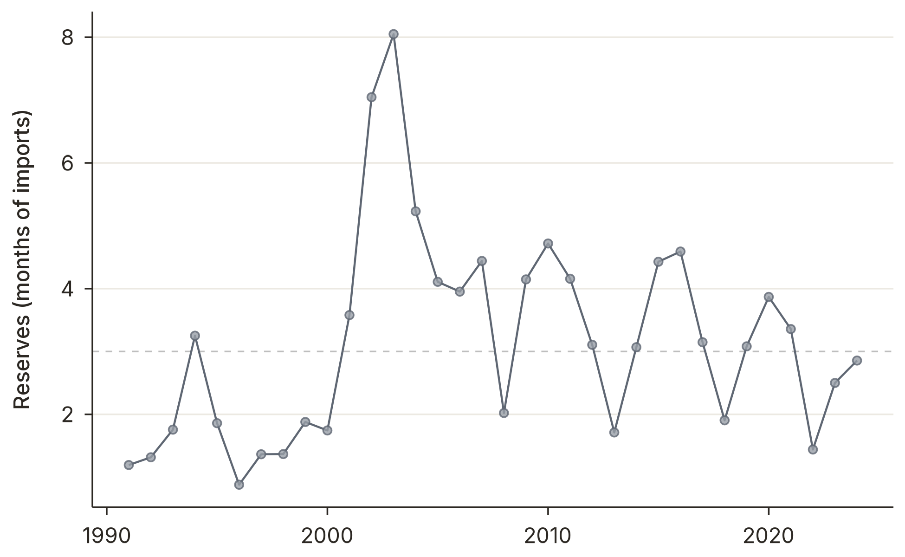{#fig:reserves}

Source: World Bank WDI [@worldbank2025wdi].

## Growth and the current account constraint

The scatter plot in @fig:growth-vs-cab illustrates the core structural problem: years of higher per capita GDP growth are systematically associated with a worsening current account balance. This "growth–current account trade-off" is not inevitable — countries that diversify their exports can grow without generating unsustainable external deficits [@hausmann2007; @hausmann2016] — but it has defined Pakistan's economic trajectory for three decades.

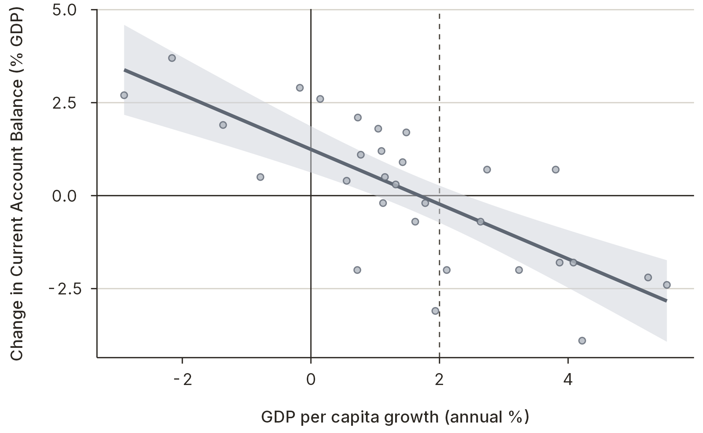{#fig:growth-vs-cab}

Source: IMF WEO October 2025.

::: {.box title="Two Perspectives on the Speed Limit"}
There are two complementary ways to understand why Pakistan's growth hits a ceiling:

1. **Fiscal imbalances** — Chronic fiscal deficits drain foreign reserves through the current account, forcing periodic stabilization.
2. **Lagging exports** — A narrow and declining export base means growth in domestic demand quickly spills into imports without a corresponding rise in foreign exchange earnings.

Both perspectives point to the same conclusion: Pakistan needs both a new macro-fiscal framework *and* a strategic approach to exports.
:::

# Fiscal Imbalances

## Current account decomposition

The current account balance can be decomposed into its fiscal and private sector components. Pakistan's data reveal that the fiscal balance is the primary driver of current account movements — when fiscal deficits widen, the current account deteriorates almost mechanically.

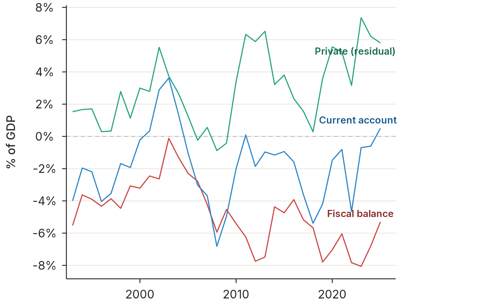{#fig:ca-decomp}

Source: IMF WEO October 2025.

## Central bank financing and reserve depletion

The State Bank of Pakistan's balance sheet tells the story of how fiscal deficits are ultimately financed. Net claims on the central government have expanded dramatically, while net foreign assets have been compressed — effectively converting domestic fiscal pressure into external vulnerability.

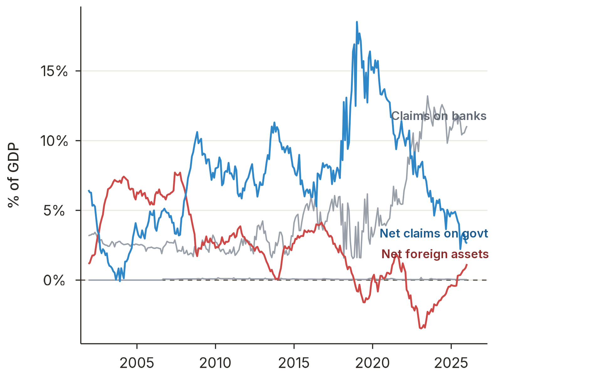{#fig:sbp}

Source: IMF Monetary and Financial Statistics; GDP from IMF WEO.

## Revenue, not expenditure, is the binding constraint

A comparison with peer countries reveals that Pakistan's expenditure levels are not unusually high. The problem lies on the revenue side: Pakistan collects significantly less than comparators at similar income levels.

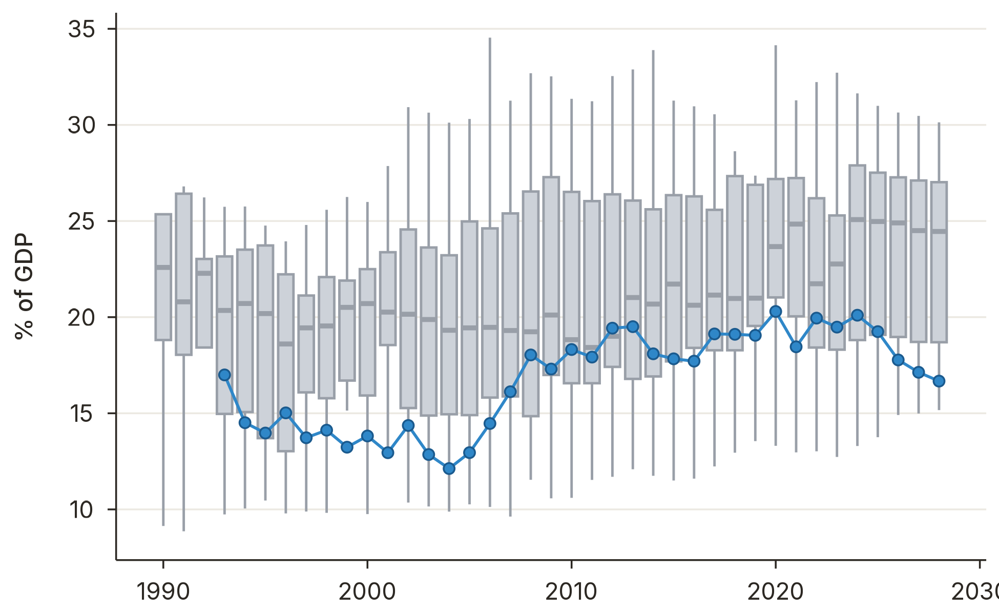{#fig:expenditure}

Source: IMF World Revenue Longitudinal Data (WoRLD).

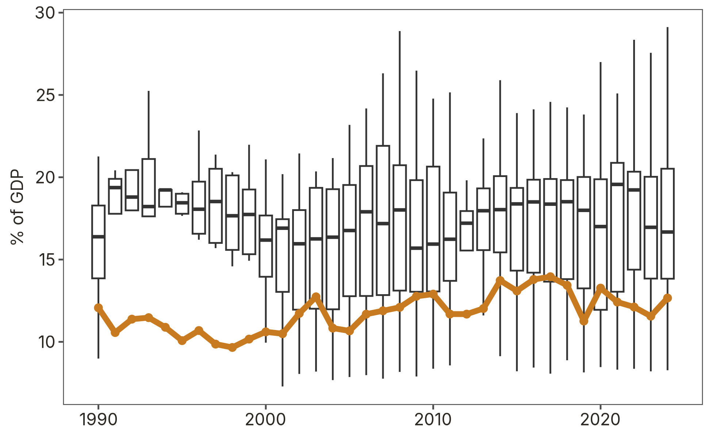{#fig:revenue}

Source: IMF World Revenue Longitudinal Data (WoRLD).

## Revenue composition

Pakistan has improved income tax collections in recent years and recently expanded its reliance on trade taxes — a move it is now winding down under IMF program conditions. The composition of revenue matters as much as the level: an over-reliance on trade taxes distorts incentives for exporters and importers alike.

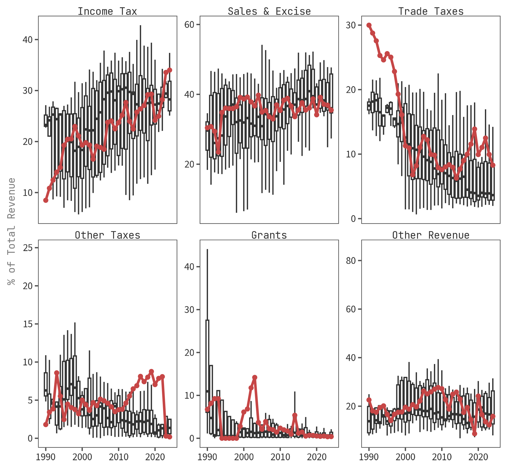{#fig:revenue-composition}

Source: IMF World Revenue Longitudinal Data (WoRLD).

## Crowding out of private credit

Fiscal deficits financed through the domestic banking system have crowded out private sector credit. Pakistan's domestic credit to the private sector as a share of GDP is among the lowest in its comparator set — a reflection of the government's dominance of the financial system.

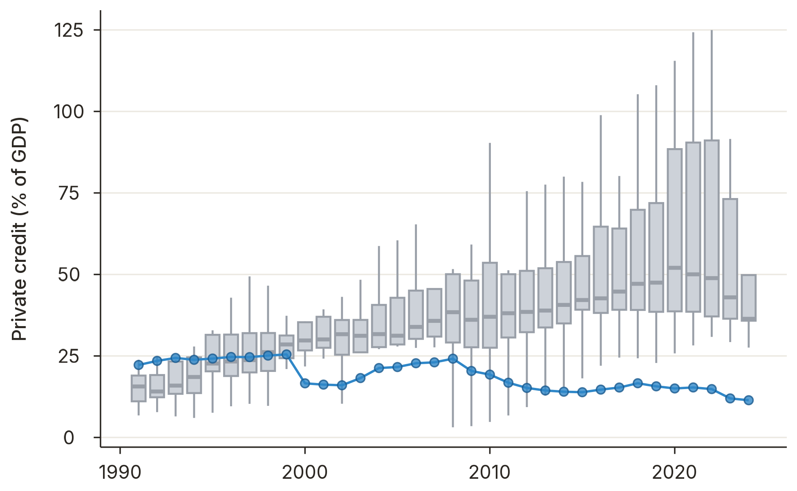{#fig:private-credit}

Source: World Bank WDI.

# Lagging Exports

## A declining export base

Pakistan's exports per capita have fallen roughly 25% since a peak in 2011. This decline is not merely a cyclical phenomenon — it reflects a structural erosion of export capacity that has left Pakistan increasingly dependent on remittances to finance its import bill.

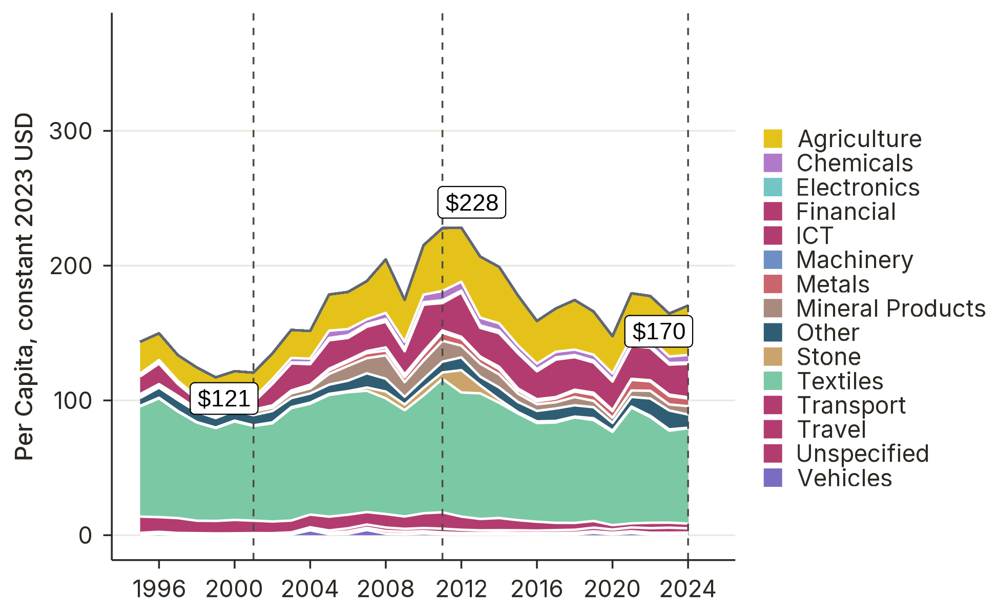{#fig:exports-percap}

Source: Atlas of Economic Complexity; IMF WEO.

## Textile concentration and losses

The losses are concentrated in Pakistan's historically dominant sector: textiles. While other sectors have shown modest gains, they have not been sufficient to offset the decline in textile exports. This concentration risk makes Pakistan's export earnings highly sensitive to global demand conditions in a single sector.

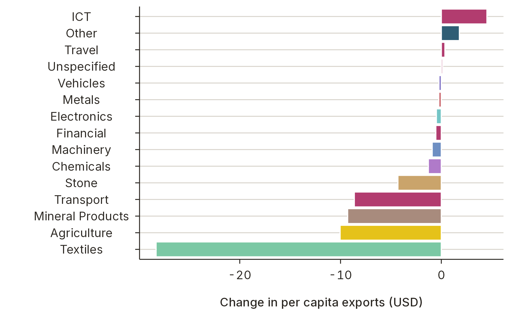{#fig:exports-drivers}

Source: Atlas of Economic Complexity.

## Decomposing the export decline

A decomposition of export per capita changes by sector reveals that the drivers differ across product groups. In some sectors, Pakistan has lost global market share; in others, population growth has outpaced export growth; in still others, global prices have moved against Pakistani products.

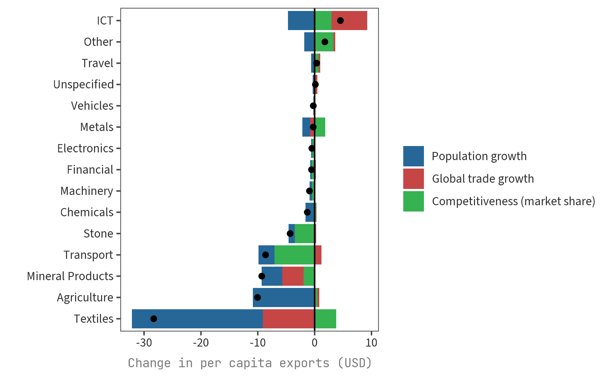{#fig:exports-decomp}

Source: Atlas of Economic Complexity.

## Remittances as a buffer

Growing remittances have partially offset the decline in export earnings, maintaining Pakistan's aggregate import capacity. But remittances are not a substitute for productive exports — they do not generate the same learning-by-doing, technology transfer, or institutional upgrading that comes from competing in global product markets.

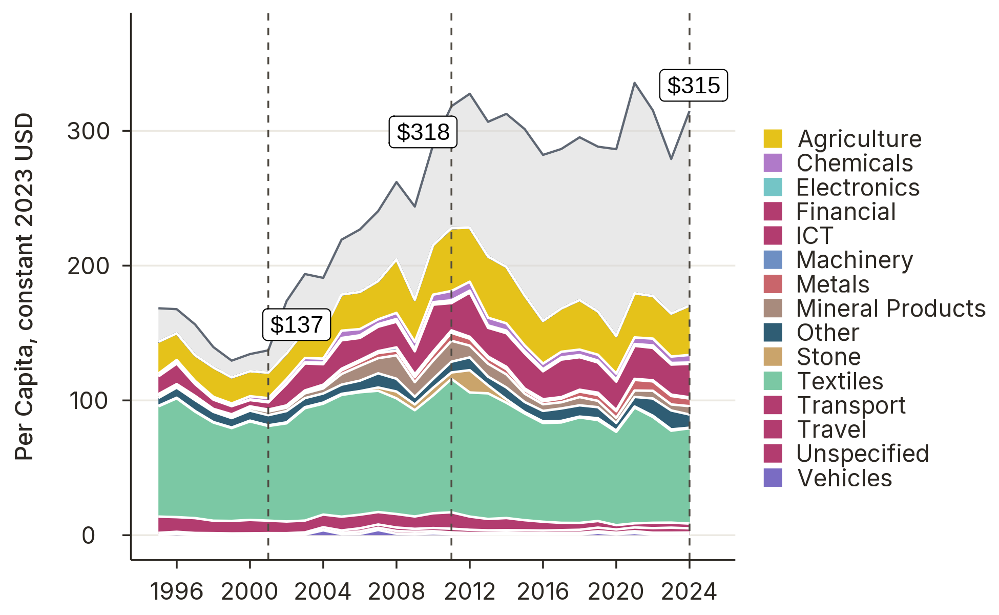{#fig:exports-remit}

Source: Atlas of Economic Complexity; World Bank WDI.

# The Energy Constraint

## Energy imports relative to income

Given Pakistan's GDP per capita, it imports relatively little energy in absolute terms. But this apparent moderation masks a deeper problem.

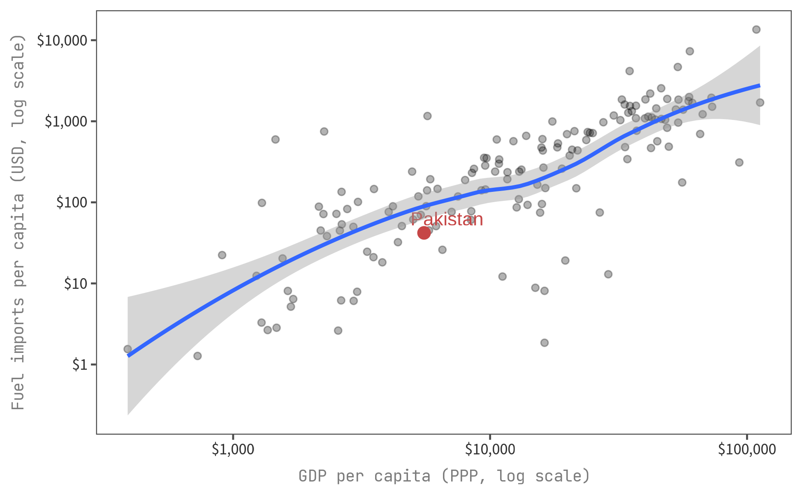{#fig:energy-imports}

Source: UN Comtrade; World Bank WDI.

## The fuel burden on exports

When measured as a share of export earnings — the relevant metric for external sustainability — Pakistan's fuel import burden is significantly higher than what its income level would predict. Energy imports consume a large fraction of the foreign exchange that exports generate, tightening the current account constraint.

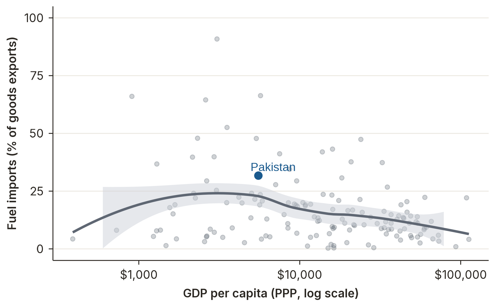{#fig:fuel-burden}

Source: UN Comtrade; Atlas of Economic Complexity.

## Fossil fuel dependence and electricity pricing

Pakistan relies heavily on fossil fuels for electricity generation and, despite charging among the highest electricity prices in its income group, still carries unfunded off-balance-sheet electricity subsidies amounting to roughly 2.2% of GDP. This circular debt ties fiscal deficits directly to dollar-denominated fuel prices, creating a channel through which energy shocks propagate into fiscal and external crises.

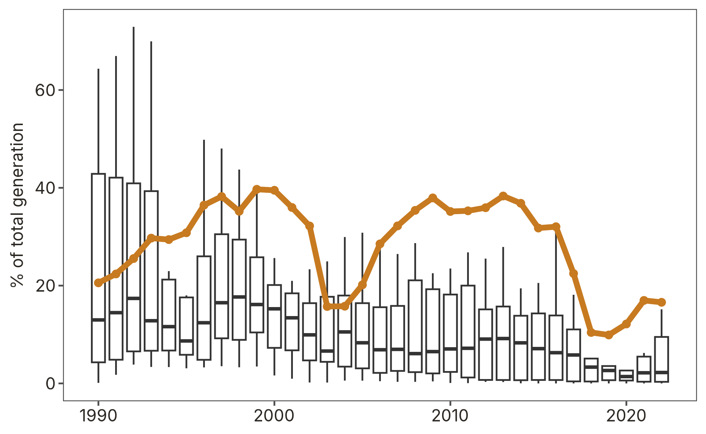{#fig:fossil-electricity}

Source: IEA; World Bank WDI.

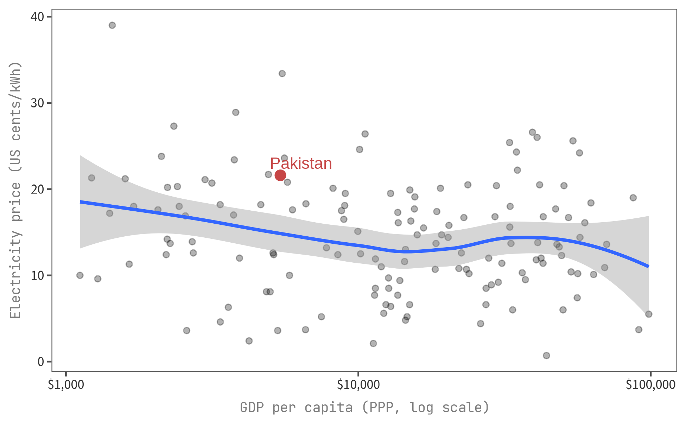{#fig:electricity-price}

Source: IEA; World Bank WDI.

# Debt Sustainability

Pakistan's external debt stock, measured against export earnings, has been rising — a concerning trend given the simultaneous decline in export capacity. Interest expense as a share of revenue has increased sharply, and the implicit interest rate on government debt has climbed, reflecting both tighter global conditions and Pakistan's elevated risk premium.

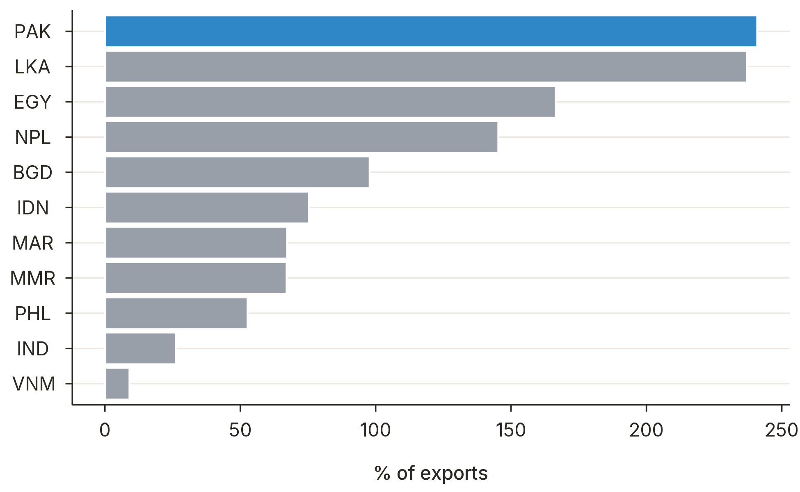{#fig:external-debt}

Source: IMF WEO; World Bank International Debt Statistics.

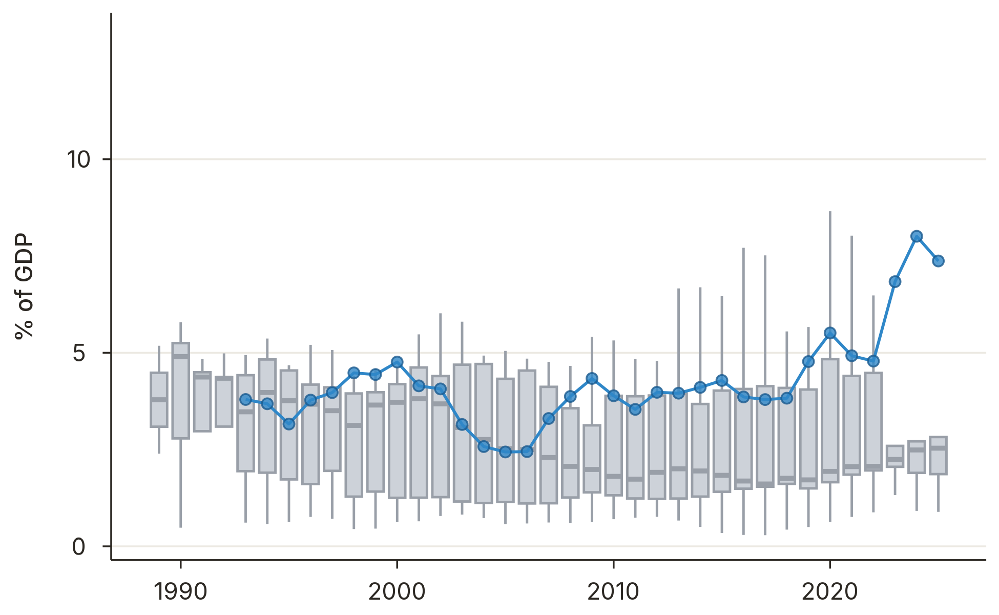{#fig:interest-expense}

Source: IMF WEO; World Bank International Debt Statistics.

# Toward a Growth Strategy

The diagnosis points to a clear conclusion: Pakistan's growth speed limit is a product of two mutually reinforcing constraints — fiscal imbalances and lagging exports. Addressing one without the other is insufficient. A fiscal consolidation that ignores export strategy will produce austerity without growth. An export strategy that ignores the macro-fiscal framework will be undermined by exchange rate instability, crowding out, and energy costs.

## Proposed engagement structure

The Growth Lab proposes an 18-month engagement structured around two pillars, connected by cross-cutting Action-Learning Teams.

| Pillar | Focus | Timeline |
|---|---|---|
| Macro-Fiscal Framework | Fiscal, monetary, and exchange rate policy that creates space for growth | Months 1–8 |
| Export Strategy | Priority sectors, value chains, and city-level constraints | Months 4–18 |
| Action-Learning Teams | Cross-cutting implementation and capacity building | Throughout |

::: {.box title="Implementation Model"}
The engagement follows two parallel tracks:

- **Track 1: Diagnose and Design** — A 4–6 month growth diagnostic followed by detailed policy frameworks for macro-fiscal and export strategy.
- **Track 2: Implementation and Adaptive Learning** — Action-learning teams embedded with government counterparts, ramping up in intensity as diagnostic findings crystallize.

The goal is not to produce a report that sits on a shelf, but to build analytical capacity within government institutions that outlasts the engagement itself.
:::

## Topics for examination

The engagement would span six interrelated policy areas:

**Macro-Fiscal Framework:**

- Fiscal policy, including fiscal federalism and the decentralization framework
- Monetary policy
- Exchange rate policy

**Export Strategy:**

- Industrial policy — existing and prospective sectors
- Trade policy
- Energy policy, with a focus on electricity
- Major cities — where growth happens, and the local constraints that hold it back

---

*This list will expand as the engagement progresses and new priorities surface through the diagnostic process.*
